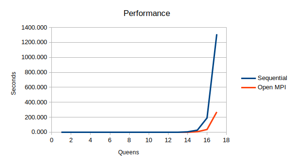
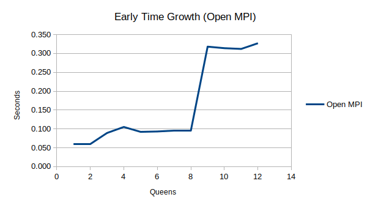

# K-Queens with OpenMPI

## Summary

The purpose of this project is to demonstrate Open MPI, an open source message passing library for high performance computing (HPC). To explore the library, this application solved the K-Queens problem--sometimes called n-queens, an expanded look at the original 8 Queens problem--where the user must place K number of queens on a chess board of K size without any queen being able to attack others.

## Variations and Rules

There are a few common variations of this problem. Some people eliminate reflections and rotations of the board and others use a superqueen, allowing movement of both a queen and a knight. Here I am not doing any of those things.

## Compile and Run

Compile this application with `mpicc -o kq -I. main.c eval.c`. This requires you to install both Open MPI build tools and utilities using a command such as (on debian-based systems) `apt install openmpi-bin libopenmpi-dev`.

Run this application with `mpirun -np 8 kq` where you may replace 8 with the number of queens desired. You are limited to the number of nodes available on the physical machine unless you reference other nodes using flag `--hostfile my_hosts` where my_hosts is a file containing hostnames and the number of nodes to use separated by a space and by a newline per host. Nodes that only run programs without the need to compile require the installation of only one package on debian-based systems with `apt install openmpi-bin`.

## Analysis

### Verification of Correctness

K queens is a well-studied problem, and the solution count data in the memory analysis below is widely available. This makes it easy to check answers. Additionally, adding a final flag of `true` to this application will cause it to print solutions to valid board states as they are discovered. The order of the solutions varies since the cluster approach uses a variety of machines with significant network IO separating them (kqs is a sequential version of the program whereas kq is the Open MPI version):

```
$ ./kqs 6 true
Solutions:
	2 4 6 1 3 5 
	3 6 2 5 1 4 
	4 1 5 2 6 3 
	5 3 1 6 4 2 
There are 4 solutions for 6 queens.

$ mpirun -np 6 kq true
	2 4 6 1 3 5 
	4 1 5 2 6 3 
	5 3 1 6 4 2 
	3 6 2 5 1 4 
There are 4 solutions for 6 queens.
```

Comparing large sets of solutions requires either manual checking or sorting the lines ahead of running a diff command on the board states.

### Memory

One method of tracking solutions would be to send the board state from a node back to the master node after determining a working set of queen positions. However, as shown in the table below, the the memory requirements quickly become massive after 16 queens. Therefore, printing solutions as they are discovered can keep this manageable. Luckily, Open MPI makes this easy. Printing on any node is streamed to the master node and printed via standard out there.

| # Queens | Solutions              | Size One Solution (B) | Size Solution Set (MB) |
|----------|------------------------|-----------------------|------------------------|
| 1        | 1                      | 4                     | 0                      |
| 2        | 0                      | 8                     | 0                      |
| 3        | 0                      | 12                    | 0                      |
| 4        | 2                      | 16                    | 0                      |
| 5        | 10                     | 20                    | 0                      |
| 6        | 4                      | 24                    | 0                      |
| 7        | 40                     | 28                    | 0                      |
| 8        | 92                     | 32                    | 0                      |
| 9        | 352                    | 36                    | 0                      |
| 10       | 724                    | 40                    | 0                      |
| 11       | 2,680                  | 44                    | 0                      |
| 12       | 14,200                 | 48                    | 1                      |
| 13       | 73,712                 | 52                    | 4                      |
| 14       | 365,596                | 56                    | 20                     |
| 15       | 2,279,184              | 60                    | 130                    |
| 16       | 14,772,512             | 64                    | 902                    |
| 17       | 95,815,104             | 68                    | 6,214                  |
| 18       | 666,090,624            | 72                    | 45,737                 |
| 19       | 4,968,057,848          | 76                    | 360,081                |
| 20       | 39,029,188,884         | 80                    | 2,977,691              |
| 21       | 314,666,222,712        | 84                    | 25,207,484             |
| 22       | 2,691,008,701,644      | 88                    | 225,838,438            |
| 23       | 24,233,937,684,440     | 92                    | 2,126,238,124          |
| 24       | 227,514,171,973,736    | 96                    | 20,829,544,553         |
| 25       | 2,207,893,435,808,352  | 100                   | 210,561,126,309        |
| 26       | 22,317,699,616,364,000 | 104                   | 2,213,516,960,241      |

### Performance

The breakeven point where my particular cluster was more efficient than the sequential approach fell just before 14 queens.

| Queens | Sequential (s) | Open MPI (s) |
|--------|----------------|--------------|
| 1      | 0.001          | 0.060        |
| 2      | 0.001          | 0.060        |
| 3      | 0.001          | 0.089        |
| 4      | 0.001          | 0.105        |
| 5      | 0.001          | 0.092        |
| 6      | 0.001          | 0.093        |
| 7      | 0.001          | 0.095        |
| 8      | 0.001          | 0.095        |
| 9      | 0.002          | 0.318        |
| 10     | 0.007          | 0.314        |
| 11     | 0.027          | 0.312        |
| 12     | 0.104          | 0.327        |
| 13     | 0.594          | 0.465        |
| 14     | 3.794          | 1.138        |
| 15     | 26.094         | 5.330        |
| 16     | 189.901        | 35.467       |
| 17     | 1309.670       | 269.381      |

The complexity of the problem increases exponentially as you increase the number of queens. However, the slope is far more forgiving on a cluster.



The performance characteristics of this application on small problems are interesting. While using 8 or fewer cores, I purposefully ran the program with a host configuration that only listed cores available on the local machine. This prevented any network IO. While the the problem remained computationally small until around 12 queens, the single network communication per node was still a significant jump in real time. One must consider this when dividing work because granular divisions of work with lots of communication could erase any benefit of cluster computing.

